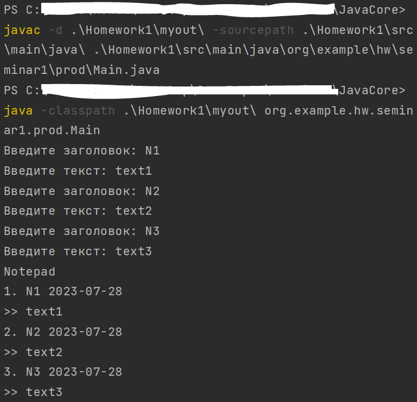
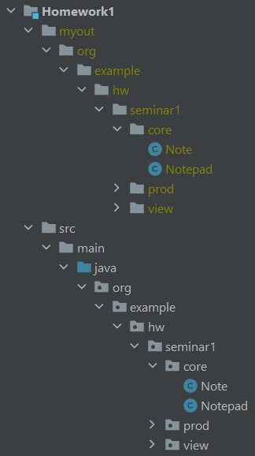

## Задание

Создать приложение с вложенностью пакетов не менее 3х, где будет класс для входа и несколько классов с логикой. 

Пример: приложение для внесения заметок во внешний файл с обязательной фиксацией времени
*	Введите заметку: Hello, world!
*	Дозапись в файл: 16.07.2023 -> Hello, world

Скомпилируйте и запустите посредством CLI

## Команды

**JavaCore>** javac -d .\Homework1\myout\ -sourcepath .\Homework1\src\main\java\ .\Homework1\src\main\java\org\example\hw\seminar1\prod\Main.java 

**JavaCore>** java -classpath .\Homework1\myout\ org.example.hw.seminar1.prod.Main 

